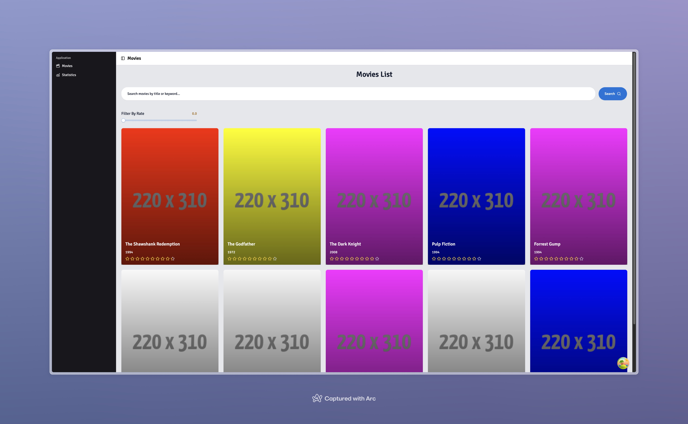

# Movies List - Technical Assignment For Glance Care Company

This project is a technical assignment for Glance Care Company. The project is a simple web application that displays a list of movies. The user can search for a movie by its title, and the application will display the list of movies that match the search query. The user can filter the movies by their ratings

This is a [React.js](https://react.dev/) project bootstrapped with [`yarn create vite`](https://vite.dev/guide/) and uses `yarn` as the package manager.

## Screenshot



## API Used

The project uses the [freetestapi.com/apis/movies](https://www.freetestapi.com/apis/movies) free api to fetch the list of movies.

## Technologies Used

- React (Vite)
- TypeScript
- Tailwind CSS
- Shadcn UI
- Tanstack/react-query
- Axios

## Getting Started

First, clone the repository:

```bash
git clone https://github.com/technohatDev/Movies-Stats-Dashboard.git
```

Then, navigate to the project directory.

Next, install the dependencies:

```bash
yarn install
```

Then, run the development server:

```bash
yarn dev
```

Open [http://localhost:5173](http://localhost:5173) with your browser to see the result.
